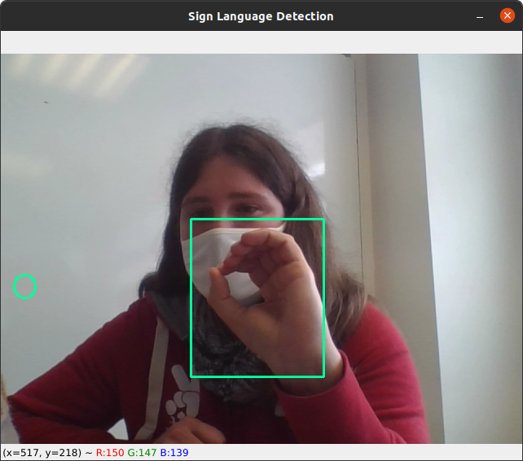
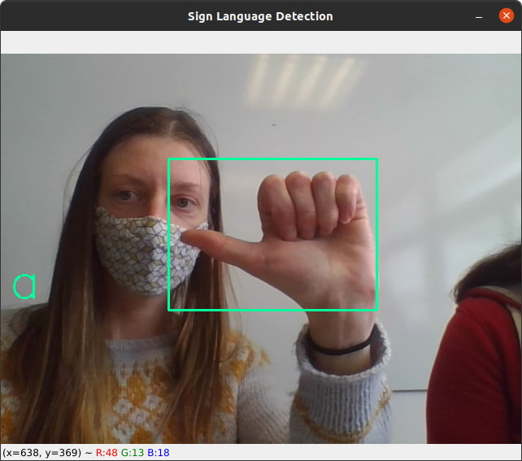
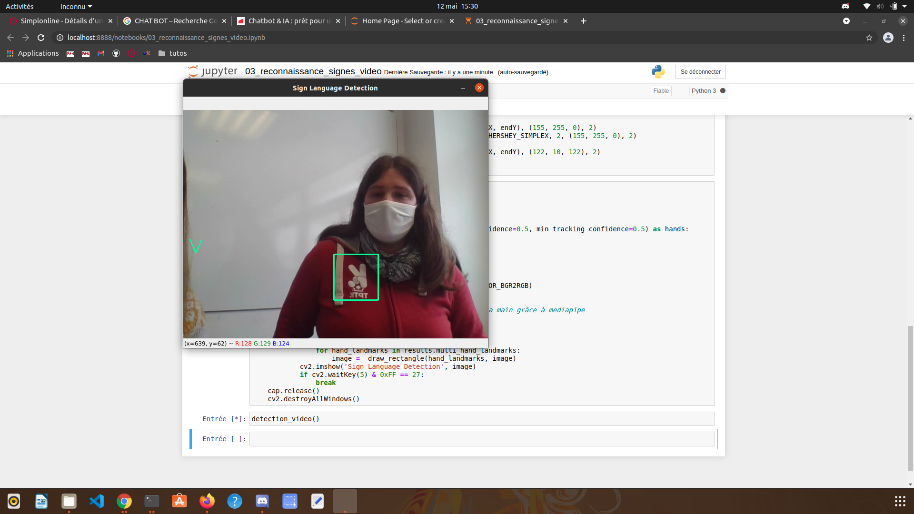
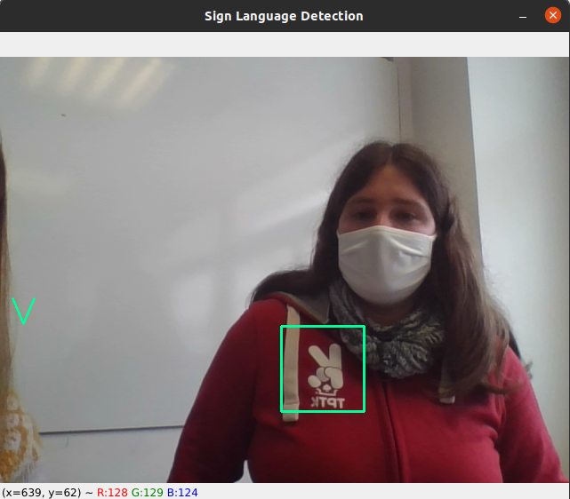

# P29_langage_signes_alphabet

*Aude, Ronan, Ludivine*

## Le projet

Le challenge ici consiste à reconnaître l'alphabet de la langue des signes françaises en direct sur une vidéo. Les différentes lettres de l'alphabet sont signées avec la main droites, face caméra.

Pour répondre à différentes contraintes de luminosité, de distance par rapport à la caméra, de background (couleur des vêtements, présence de mances sur les vêtements, etc.), nous avons choisi de procéder en deux temps :
- d'abord, détecter et extraire l'image de la main dans la vidéo, 
- ensuite, classifier l'image extraite pour reconnaître le signe effectué.

## Méthodologie

Pour la détection de la main dans l'image, nous avons fait un premier essai avec Tensorflow Detection API et le modèle EfficientDet-d0 préentrainé sur le dataset Coco.<br> 
Les résultats de ce transfert d'apprentissage étant très décevants, nous avons décidé d'utiliser un module de détection des mains existant issu de la bibliothèque [Mediapipe](https://mediapipe.dev/) développée par Google. Ce module, [Mediapipe Hands](https://google.github.io/mediapipe/solutions/hands), est entraîné à inférer d'une image 21 points 3D situés à des endroits stratégiques de la main (phalanges, base du poignet, etc.).<br>

Une possibilité pour réaliser la classification aurait été d'exploiter les coordonnées relatives de ces 21 points. Ce travail ayant déjà été réalisé par d'autres groupes avant nous, nous avons préféré construire un modèle différent afin de pouvoir comparer les résultats.<br>
Notre reconnaissance des signes se base donc sur un CNN de classification d'images. Il est entraîné dans le [notebook 02](02_classification_signes.ipynb).

## Dataset

Un dataset commun à l'ensemble des groupes de travail a été constitué. Nous avons réutilisé ce dataset, que nous avons trié et enrichi par endroits.<br>

Le [notebook 01](01_capture_webcam.ipynb) présente la façon dont on il est possible de prendre et enregistrer des photos grâce à la webCam d'un ordinateur en utilisant la bibliothèque Python Open-CV, soit en cascade, soit en appuyant sur une touche du clavier.


## Résultats

Bien que les résultats de la détection avec Médiapipe sont exellents (on peut observer ces résultats en lançant la détection vidéo du [notebook 03](03_reconnaissance_signes_video.ipynb)), et que nos modèles de classification montrent tous également de bons résultats sur les photos (voir le [notebook 02](02_classification_signes.ipynb)), les résultats sont bien plus mitigés en conditions réelles.

### Architecture utilisée

Nous avons utilisé un CNN pour la résolution du problème de reconnaissance :

```python
modelX = models.Sequential()

modelX.add(Conv2D(64, 7, padding="same", activation='relu', input_shape=(60,60,3)))
modelX.add(MaxPooling2D(2))
modelX.add(Dropout(0.5))
modelX.add(Conv2D(64, 3, padding="same", activation='relu'))
modelX.add(MaxPooling2D(2))
modelX.add(Dropout(0.5))
modelX.add(Conv2D(128, 3, padding="same", activation='relu'))
modelX.add(MaxPooling2D(2))
modelX.add(Dropout(0.5))
modelX.add(Flatten())
modelX.add(Dense(64, activation="relu"))
modelX.add(Dropout(0.25))
modelX.add(Dense(32, activation="relu"))
modelX.add(Dropout(0.25))
modelX.add(Dense(NUM_CLASS, activation='softmax'))
```

Ce modèle, très rapide à entrîner étant-donnée la taille réduite du dataset, a été entrainé deux fois avec l'optimisateur Adamax et pour des learning rate et valeurs de beta différents. Après 180 epochs (les deux entrainement confondus), nous avons atteind un palier à 82.42% d'accuracy sur le set de validation :<br>
`264/264 [==============================] - 1s 6ms/step - loss: 0.7546 - accuracy: 0.7720 - val_loss: 0.6568 - `
`val_accuracy: 0.8242`

Courbes d'accuracy et de loss de l'entraînement :


### Résultats de la reconnaissance des signes sur les images

La matrice de confusion retournée par notre modèle sur le set de test est la suivante :


Les résultats semblent excellents, mais il faut mettre celà en perspective : les photos des datasets de test et d'entrainement se ressemblent énormément : elles ont été faites par seulement une dizaine de personnes différentes, à des distances équivalentes de la caméra, dans des conditions d'éclairage similaires, etc.


### Résultats de la reconnaissance video

Les bons résultats sur la vidéo sont beaucoup plus difficiles à obtenir. Voici un extrait des quelques lettres qui sont relativement bien reconnues.







## Conclusion

Les résultats obtenus par les groupes qui ont utilisé les coordonnées des landmarks médiapipe pour la reconnaissance des signes sont globalement meilleurs que les nôtres. 

Pour cette application en particulier, l'utilisation d'un CNN appliqué à une image 2D est possible, et pourrait donner des résultats corrects avec un meilleur entraînement et un dataset de départ plus fourni. Mais cette méthode n'est pas efficiente comparée avec celle du traitement des landmarks.
